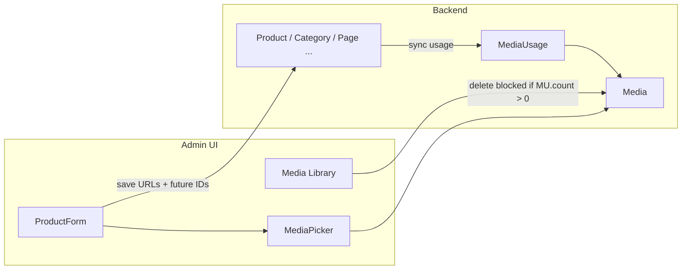

# Media Usage Safety & Delete Protection Plan

**Status:** Planning only (Media-5A — no implementation in this phase)  
**Project:** Reusable Ecommerce Admin + Backend  
**Version:** Media-5  
**Last updated:** 2026-05-20  
**Related:** `MEDIA_PICKER_ARCHITECTURE.md`, `MediaLibrary.jsx`, `ProductForm.jsx`, `Media` model, `Product` model

---

## 1. Current state

### What exists today

| Area | Behavior |
|------|----------|
| **Media Library** | Full admin page: list, search, folder/type filters, upload, edit metadata (title, alt, folder), **hard delete** via `DELETE /api/media/:id`, copy URL. `Media` records include `filePath`, `fileUrl`, `isActive`, timestamps, `uploadedBy`. |
| **MediaPicker** | Integrated into `ProductForm` for **Featured Image** (single) and **Gallery Images** (multi, max 20). Operators choose from library or upload new; uploads create `Media` records via `POST /api/media/upload`. |
| **Product storage** | Products still persist **URL strings only**: `featuredImage: string`, `galleryImages: string[]`. No `featuredMediaId` or `galleryMediaIds` on the product model yet. |
| **URL normalization (admin)** | Media-4A/4E added client-side path normalization and dedupe when merging gallery selections and submitting payloads. Relative and absolute URL forms collapse for UI consistency; backend still stores whatever URLs the client sends. |
| **Usage tracking** | **None.** Backend does not index which entities reference which media records. |
| **Delete safety** | Deleting a `Media` row does not check products, categories, pages, or other entities. Products may continue to reference the old URL → **broken images** on storefront and admin. |
| **Product ↔ Media relation** | **Implicit** via URL string match only. A product may reference `/uploads/media/a.jpg` while the library record uses the same path with a different MongoDB `_id`. Duplicate library rows for the same file are possible. |

### What does not exist yet

- `MediaUsage` collection or usage index
- `usageCount` on `Media`
- “Used by” UI in Media Library
- Delete/archive blocking when media is referenced
- Replace-media workflow
- Unused-media cleanup reports
- Product fields for media IDs
- Usage rebuild jobs or webhooks on product save

---

## 2. Problem statement

### Risks of the current model

1. **Unsafe deletion** — An operator can delete a media asset from the library while one or more products still reference its `fileUrl` / path. The product save API and storefront continue to serve the old URL string; the file may be removed from disk or the record gone from the library with no warning.

2. **Broken product images** — Broken heroes, empty gallery slots, and inconsistent cart/order line snapshots (many flows copy `featuredImage` URL at add-to-cart time). Support burden and trust loss on the storefront.

3. **Duplicated media references** — Same physical file uploaded multiple times creates multiple `Media` documents. Products may point at different URLs for the same image. Usage counts and cleanup become unreliable without normalized path matching.

4. **No “used by” visibility** — Operators cannot answer: “Can I delete this?” or “Which products use this banner?” without manual DB or grep work.

5. **No safe cleanup path** — No supported workflow to find **unused** assets, archive them, or bulk-delete only after confirmation. Admins may avoid cleaning up (storage bloat) or delete aggressively (outages).

6. **No future-proof relation** — URL-only coupling does not survive CDN domain changes, storage migration, image optimization variants, or rename/move operations. Media IDs plus resolved URLs are the standard DAM pattern.

7. **Ambiguous detach vs delete** — Removing an image from a product form should **detach** the reference, not delete the underlying library asset. Today those actions are separate UIs with no shared semantics.

8. **Draft and multi-entity usage** — Products in `draft` status, categories, brands, CMS pages, and banners may all reference URLs with no central registry—delete risk extends beyond published products.

---

## 3. Recommended architecture

### Design principles

- **Media Library is the system of record** for binary assets and metadata.
- **Entities reference media** via stable IDs where possible; URLs remain a **denormalized cache** for storefront/API compatibility during migration.
- **Usage is explicit** — prefer a `MediaUsage` index over inferring usage only at delete time.
- **Prefer soft lifecycle** — archive before hard delete; hard delete only when usage count is zero and policy allows.
- **Fail closed on destructive actions** — block delete when usage &gt; 0; offer replace or detach guidance.

### Core capabilities

| Capability | Purpose |
|------------|---------|
| **MediaUsage tracking** | Rows linking `mediaId` → `entityType` + `entityId` + `field` (e.g. `product.galleryImages`). Enables counts, lists, and rebuild. |
| **Product-to-Media references** | `featuredMediaId`, `galleryMediaIds[]` alongside existing URL fields during transition. |
| **Soft delete / archive** | `isArchived`, `deletedAt`; hide from picker by default; optional rules for storefront display. |
| **Used-by count** | Denormalized `usageCount` on `Media` for fast table sort/filter; rebuilt from `MediaUsage` or recalculated on demand. |
| **Delete blocking** | `DELETE /api/media/:id` returns `409 Conflict` with usage payload when referenced. |
| **Replace media workflow** | Atomic update: swap media ID/URL on all usages (or selected usages), decrement old, increment new. |
| **Cleanup unused assets** | Report + bulk archive; bulk hard-delete only for archived + zero usage + confirmation. |

### High-level flow

---

## 4. Recommended future data model

*Planned fields/tables only — not implemented in Media-5.*

### Media model additions

| Field | Type | Notes |
|-------|------|--------|
| `isArchived` | Boolean | Default `false`. Archived assets hidden from picker default view; may still be referenced. |
| `deletedAt` | Date \| null | Soft-delete timestamp; null = active. |
| `usageCount` | Number | Denormalized; maintained by usage sync job or hooks. |
| `lastUsedAt` | Date \| null | Max `MediaUsage.updatedAt` for this media. |
| `storageProvider` | String | e.g. `local`, `s3`, `cloudinary` — future multi-backend. |
| `thumbnailUrl` | String | Small preview for library grid. |
| `optimizedUrls` | Object | e.g. `{ webp: {}, avif: {}, sizes: { sm, md, lg } }` — CDN/variant map. |

Existing fields retained: `fileName`, `filePath`, `fileUrl`, `mimeType`, `size`, `type`, `folder`, `altText`, `title`, `uploadedBy`, `isActive`, `timestamps`.

### Product model future fields

| Field | Type | Notes |
|-------|------|--------|
| `featuredMediaId` | ObjectId \| null | Ref `Media`; optional during Phase B+. |
| `galleryMediaIds` | ObjectId[] | Ordered; max 20; mirrors gallery order. |
| `featuredImage` | String | **Retained** for storefront/backward compatibility. |
| `galleryImages` | String[] | **Retained**; resolved from media records on save. |

Same pattern can extend to **Category**, **Brand**, **Page**, **Banner**, **Variation.image**, etc., with entity-specific `field` values in `MediaUsage`.

### MediaUsage table (recommended)

| Field | Type | Notes |
|-------|------|--------|
| `id` | ObjectId | Primary key. |
| `mediaId` | ObjectId | Ref `Media`; indexed. |
| `entityType` | String | e.g. `product`, `category`, `brand`, `page`, `banner`, `variation`. |
| `entityId` | ObjectId | Target document ID. |
| `field` | String | e.g. `featuredImage`, `galleryImages`, `logo`, `sectionImage`. |
| `urlSnapshot` | String | Optional; normalized path at time of link — helps URL-phase matching and audits. |
| `createdAt` | Date | |
| `updatedAt` | Date | |

**Indexes (planned):** `(mediaId)`, `(entityType, entityId)`, unique compound `(mediaId, entityType, entityId, field, position?)` for gallery slots if per-index usage rows are needed.

### Entity / field examples

| Entity | Field(s) | Usage row example |
|--------|----------|-------------------|
| Product | `featuredImage` | `product`, `{id}`, `featuredImage` |
| Product | `galleryImages` | `product`, `{id}`, `galleryImages` (one row per slot or one row with index in metadata) |
| Category | `image` | `category`, `{id}`, `image` |
| Brand | `logo` | `brand`, `{id}`, `logo` |
| CMS Page | `featuredImage`, section images | `page`, `{id}`, `featuredImage` / `sectionImage` |
| Banner | `image` | `banner`, `{id}`, `image` |

---

## 5. Migration strategy: URL-based → ID-based

### Phase A — URL usage scan (read-only)

- Keep `featuredImage` and `galleryImages` as the only persisted product image fields.
- On demand or scheduled job: scan products (and later other entities) and match `fileUrl` / normalized path against `Media.fileUrl` / `filePath`.
- Expose **read-only** usage in admin: “Likely used in N products” (heuristic; may miss external URLs or orphan URLs).

### Phase B — Optional media IDs on products

- Add `featuredMediaId`, `galleryMediaIds[]` to schema **optional**, nullable.
- Admin continues to save URLs; backend optionally resolves IDs on save when URL matches exactly one library record.

### Phase C — Dual-write

- `ProductForm` sends URLs **and** IDs from MediaPicker selection.
- API writes both; `MediaUsage` rows created/updated on product create/update.
- Storefront still reads URL fields only.

### Phase D — Admin prefers IDs

- MediaPicker and ProductForm display from `Media` by ID; URLs regenerated from `Media.fileUrl` on save.
- URL fields remain populated for legacy clients and exports.

### Phase E — Backfill and cleanup (optional)

- Script: for products with URLs but no IDs, match library and set IDs + usage rows.
- Report URL-only references with no matching `Media` (orphan URLs).
- Optional: dedupe duplicate `Media` rows pointing at same `filePath`.

---

## 6. Delete protection strategy

### Rules

| Condition | Hard delete | Archive | Notes |
|-----------|-------------|---------|--------|
| `usageCount === 0` and not archived | Allowed (with confirm) | Allowed | Default safe path: archive first. |
| `usageCount > 0` | **Blocked** | Allowed only if product visibility rules are documented (see §17) | Return `409` + usage list. |
| Archived + `usageCount === 0` | Allowed (bulk cleanup phase) | N/A | Extra confirmation; optional retention period. |
| Archived + `usageCount > 0` | **Blocked** | — | Still referenced; must replace or detach first. |

### Operator messaging

- **Block message:** “This image is used in {count} places. Remove it from those items or use Replace Media before deleting.”
- **Actions offered:** View usage list, Replace media, Copy URL (read-only), Archive (if policy allows while in use).

### Archive vs delete while in use

- **Recommended default:** Archived media **remain servable** at existing URLs so published products do not break; hide from default picker and flag in library as “In use (archived)”.
- **Alternative (strict):** Archive blocks new selections but existing product URLs unchanged until operator replaces—document which policy the business chooses (§17).

### Replace instead of delete

When media is used, the primary remediation is **Replace Media** (§9), not force delete.

---

## 7. Media Library UX recommendations

### Table and filters

| Feature | Description |
|---------|-------------|
| **Used By column / badge** | `Used (12)` or `Unused`; click opens details. |
| **Usage details drawer** | List entities: type, name, field, link to edit screen, status (draft/published). |
| **Filter: Used / Unused** | Query `usageCount` or `usage=used\|unused`. |
| **Filter: Archived / Active** | Default: Active only. |
| **Filter: Orphan URLs** | Phase A: media with no file on disk (optional). |

### Actions

| Action | Behavior |
|--------|----------|
| **Archive** | Soft-hide; confirm; blocked messaging if hard-delete attempted while in use. |
| **Restore** | Clear `isArchived` / `deletedAt`. |
| **Delete** | Only if unused; strong confirm; show file size freed. |
| **Replace** | Opens picker; updates all usages (or scoped selection in v2). |
| **Bulk archive unused** | Select filter Unused → bulk archive with count summary. |
| **Bulk delete** | Only **archived + unused**; type-to-confirm (“DELETE 42 FILES”). |

### Visual cues

- Row disabled delete icon when `usageCount > 0`.
- Tooltip on hover: first 3 usage labels + “and N more”.

---

## 8. ProductForm UX (future)

### Storage model

- **Featured:** `featuredMediaId` + `featuredImage` (resolved URL).
- **Gallery:** ordered `galleryMediaIds[]` + `galleryImages[]` (parallel arrays or resolved on save).

### Behaviors

| Action | Expected behavior |
|--------|-------------------|
| **Select from picker** | Attach usage rows; increment `usageCount`; do not delete other media. |
| **Remove from product** | Remove ID/URL from product; **detach** usage row; decrement count; **do not** delete library asset. |
| **Save product** | Sync `MediaUsage` for this product; rebuild normalized URL snapshots. |
| **Delete product** | Remove all `MediaUsage` rows for that `entityId`; decrement affected media counts. |
| **Draft product** | **Decision:** count as usage by default so draft heroes are protected (§17). Config flag: `usage.includeDrafts`. |

### MediaPicker

- Pass selected assets with **stable `id`** (Mongo `Media._id`) plus URL for preview.
- Preselect open state uses ID match first, URL path fallback (current Media-4 pattern extended).

---

## 9. Replace media workflow

### Professional flow

1. Operator selects one or more **in-use** assets in Media Library (or starts from usage drawer on a single asset).
2. Clicks **Replace**.
3. Chooses replacement via MediaPicker (library or upload).
4. System updates:
   - All `MediaUsage` rows: `mediaId` old → new (or per-entity scope in v2).
   - All entity fields: product `featuredImage` / `galleryImages`, category `image`, etc.
   - Regenerates URL strings from new `Media.fileUrl`.
5. Old media `usageCount` decremented; new media incremented.
6. Old media becomes **unused** → eligible for archive/delete.
7. Optional prompt: “Archive previous asset?”

### Edge cases

- Replacement across **gallery order** must preserve index.
- If replacement file has different aspect ratio, no automatic crop in v1—document for operators.
- Bulk replace (same hero for 50 products) is a later enhancement (Media-5G+).

---

## 10. Cleanup unused assets

### Unused media report

| Column | Source |
|--------|--------|
| Preview | `thumbnailUrl` or `fileUrl` |
| File name | `fileName` |
| Folder | `folder` |
| Uploaded | `createdAt`, `uploadedBy` |
| Size | `size` |
| Last used | `lastUsedAt` or “Never” |
| Usage count | `0` only in report |

### Cleanup policy (recommended)

1. **Identify** — `usageCount === 0`, `isArchived === false`, older than N days (configurable).
2. **Bulk archive** — safe default; reversible.
3. **Bulk hard delete** — only items already archived, unused, and past retention window; require typed confirmation and show total MB.

### Safety

- Never include `usageCount > 0` in bulk delete query.
- Dry-run mode: “Would archive 128 files (340 MB)” before apply.

---

## 11. Backend / API planning

*Suggested future endpoints — not implemented.*

| Method | Endpoint | Purpose |
|--------|----------|---------|
| GET | `/api/media/:id/usage` | Paginated list of `MediaUsage` with entity summary. |
| GET | `/api/media` | Query params: `usage=used\|unused`, `archived=true\|false`, existing search/folder filters. |
| PATCH | `/api/media/:id/archive` | Set `isArchived`, `deletedAt`. |
| PATCH | `/api/media/:id/restore` | Clear archive flags. |
| DELETE | `/api/media/:id` | Hard delete **only if** `usageCount === 0`; else `409`. |
| POST | `/api/media/:id/replace` | Body: `{ replacementMediaId, scope?: 'all' \| entityIds[] }`. |
| POST | `/api/media/rebuild-usage-index` | Admin-only; scan entities, rebuild `MediaUsage` + counts. |
| GET | `/api/media/reports/unused` | Report for cleanup UI. |

### Product API (future hooks)

- On `POST/PUT /api/products/:id`: call `syncProductMediaUsage(product)` when image fields change.
- No change to public response shape required in early phases if URLs remain populated.

---

## 12. Usage detection logic

### Phase A — URL matching (current system)

1. Normalize candidate URL and `Media.fileUrl` / `filePath` to a canonical path (same rules as admin `normalizeMediaUrlPath`: strip origin, query, hash, lowercase path).
2. Query products where `featuredImage` or `galleryImages[]` matches path.
3. Extend to categories, brands, pages when those modules store URLs.

**Limitations:** External URLs (CDN outside library), typo URLs, deleted files with no `Media` row, duplicate `Media` rows for same path.

### Phase B+ — Media ID matching

1. Primary key: `MediaUsage.mediaId`.
2. On product save: if `featuredMediaId` set, upsert usage row; remove stale rows for that field.
3. Gallery: one usage row per index or single row with ordered array in metadata—pick one model and stay consistent.

### Duplicate media records

- Two `Media` docs with same normalized path: URL scan may show usage on both; migration script should merge or mark duplicate.
- Picker should prefer canonical record (oldest `createdAt` or explicit `canonicalMediaId` link—future).

### Missing files

- `filePath` exists in DB but file missing on disk: flag `fileStatus: missing` in library; do not auto-delete usage.

---

## 13. Permissions

### Recommended permission keys

| Permission | Scope |
|------------|--------|
| `media.view` | List, preview, usage read |
| `media.upload` | Upload, edit metadata |
| `media.select` | Use in pickers (ProductForm, etc.) |
| `media.archive` | Archive / restore |
| `media.delete` | Hard delete unused |
| `media.replace` | Replace in usages |
| `media.rebuild-usage` | Reindex job |

### Initial default (recommended)

- **admin**, **super_admin:** all media permissions including delete, archive, replace, rebuild.
- **editor / merchandiser (if role exists):** `view`, `upload`, `select`; no delete/replace/rebuild until trained.
- Enforce on API middleware, not UI-only.

---

## 14. Audit / activity logs

Log events (admin activity stream or structured logs):

| Event | Payload hints |
|-------|----------------|
| `media.uploaded` | `mediaId`, `fileName`, `folder`, `uploadedBy` |
| `media.selected_for_entity` | `mediaId`, `entityType`, `entityId`, `field` |
| `media.detached_from_entity` | Same |
| `media.archived` / `media.restored` | `mediaId`, `actor` |
| `media.delete_blocked` | `mediaId`, `usageCount`, `sampleEntities` |
| `media.deleted` | `mediaId`, `filePath` (no binary in log) |
| `media.replaced` | `oldMediaId`, `newMediaId`, `affectedCount` |
| `media.usage_rebuilt` | `scanned`, `rowsWritten`, `durationMs` |

Retention: align with existing admin audit policy (90 days minimum suggested for compliance disputes).

---

## 15. Future scalability

| Area | Direction |
|------|-----------|
| **CDN** | `fileUrl` points to CDN; `storageProvider` + signed URLs; usage still by `mediaId`. |
| **Cloud storage** | S3/GCS backend; `filePath` as object key; delete protection before object deletion. |
| **Image optimization** | `optimizedUrls` variants; storefront template picks `webp`/`avif` with fallback. |
| **Responsive sizes** | Width buckets in `optimizedUrls.sizes`; admin picker shows one preview URL. |
| **AI alt text** | Optional job writes `altText`; logged as `media.metadata_updated`. |
| **Supplier / import** | Import creates `Media` + usage in bulk; URL columns in CSV map to attach or create media. |
| **Scheduled cleanup** | Cron: archive unused &gt; 90 days; notify admin summary. |
| **External URLs** | Policy decision: import into library vs allow external-only URL on product without `mediaId` (§17). |

---

## 16. Recommended implementation phases

| Phase | ID | Scope |
|-------|-----|--------|
| **Planning** | **Media-5A** | This document only. |
| **Read-only usage** | **Media-5B** | Backend scan: URL/path match products (and later entities); `GET /api/media/:id/usage` read-only or computed. |
| **Library UX** | **Media-5C** | Used By badge, usage drawer, Used/Unused filter (read-only data). |
| **Delete protection** | **Media-5D** | Block hard delete when used; archive endpoint; 409 responses. |
| **Product media IDs** | **Media-5E** | Schema: optional `featuredMediaId`, `galleryMediaIds[]`. |
| **Dual-write** | **Media-5F** | ProductForm + product API write IDs + URLs; sync `MediaUsage` on save. |
| **Replace workflow** | **Media-5G** | Replace API + Media Library UI + entity URL updates. |
| **Unused cleanup** | **Media-5H** | Report, bulk archive, guarded bulk delete. |

**Dependency order:** 5B → 5C → 5D can ship incrementally; 5E–5F before full replace (5G); 5H after accurate usage index.

---

## 17. Risks and open decisions

| # | Decision | Options | Recommendation (starting point) |
|---|----------|---------|----------------------------------|
| 1 | Should **archived** media still display on products? | A) Yes, URL still works. B) No, hide/break until replaced. | **A** — avoid breaking live storefront; hide from picker only. |
| 2 | Should **draft** products count as usage? | A) Yes. B) No. C) Config flag. | **A** with optional **C** `usage.includeDrafts` default true. |
| 3 | Hard delete vs soft delete only? | Soft only vs soft + hard for unused. | **Soft archive default**; hard delete only when `usageCount === 0` and confirmed. |
| 4 | Should **external URLs** be imported into Media Library? | Auto-import on paste vs URL-only without `mediaId`. | **Manual import** first; URL-only allowed but excluded from library delete rules. |
| 5 | **usageCount**: live vs stored? | Recompute on read vs denormalized + rebuild job. | **Stored + rebuild job** for performance; validate on delete (recompute if stale). |
| 6 | Product image change triggers usage rebuild? | Per-save sync vs nightly job. | **Per-save sync** for products in 5F; nightly full rebuild as safety net. |
| 7 | One **MediaUsage** row per gallery slot vs one row per product gallery? | Per-index rows vs array field. | **Per-index rows** for precise replace/remove; clearer audit. |
| 8 | **Variation** images | Separate entityType `variation` vs nested under product. | **`variation`** rows with `entityId` = variation subdoc id or SKU key. |
| 9 | Delete **file on disk** when Media row deleted? | Immediate vs garbage collection delay. | **Delayed GC** (7 days) after hard delete for recovery. |
| 10 | **Permissions** for replace affecting many products? | Single role vs approval workflow. | **admin** only for multi-entity replace in v1. |

### Technical risks

- **Stale URL after CDN migration** — Dual-write IDs reduces risk; rebuild job required after bulk URL changes.
- **Race on delete** — Two admins: one deletes media, one saves product referencing it → use transaction or recheck usage at delete time.
- **Performance** — Full table scan for URL usage does not scale; move to `MediaUsage` index early (5F).
- **False negatives in Phase A** — URL-only heuristic misses usages; communicate “estimated usage” in UI until 5F.

---

## Summary

The admin has successfully moved product image selection to the Media Library via MediaPicker, but **safety lags behind convenience**: products still store URLs, and media can be deleted without usage checks. The professional path is an explicit **MediaUsage** index, **soft archive**, **delete blocking**, **replace workflow**, and a phased migration to **media IDs** while keeping **URL fields** for storefront compatibility. Implementation should follow phases **5B → 5H**, with this document ( **Media-5A** ) as the single source of truth until development begins.

---

*No application code, configuration, database schema, or API routes were modified in Media-5A.*
